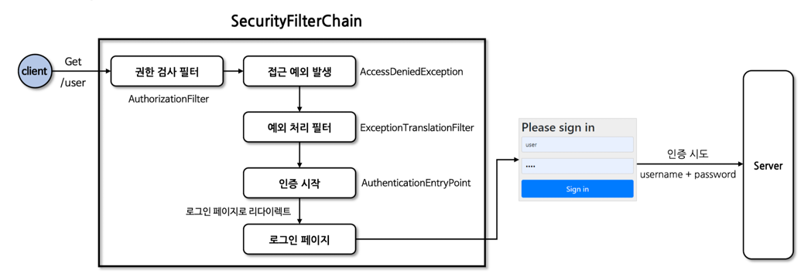
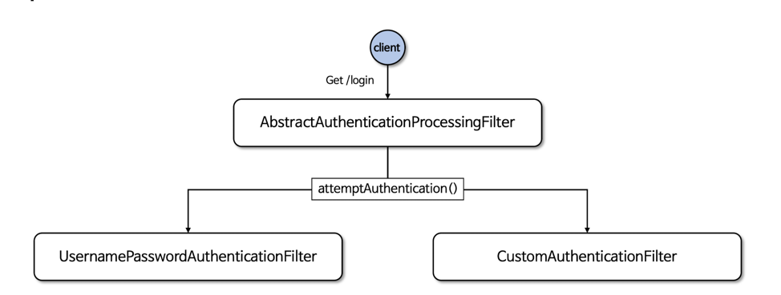
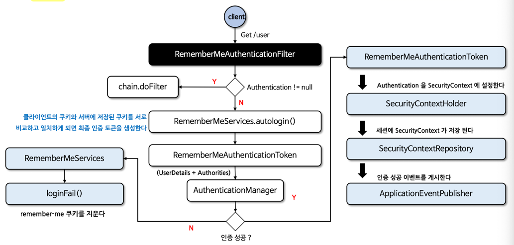
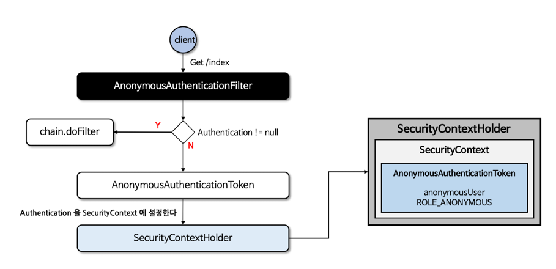
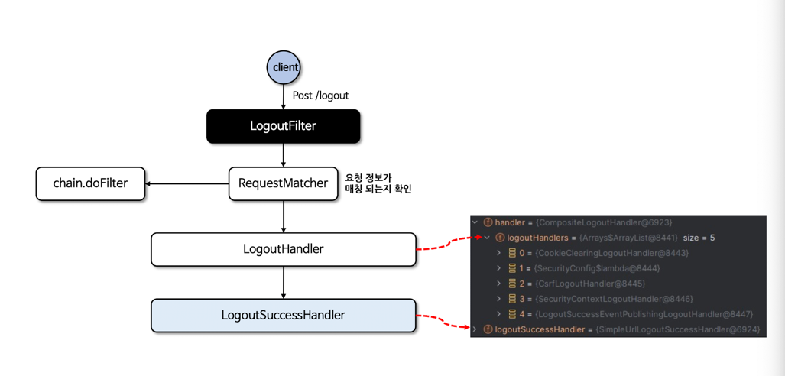
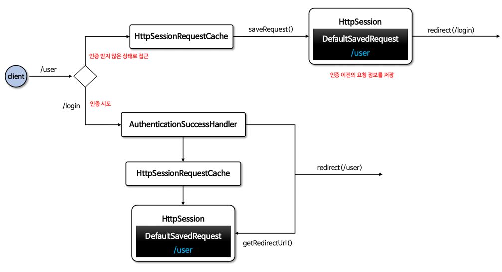
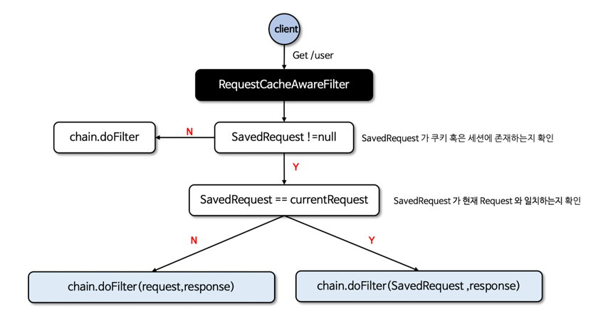

# 섹션 3. 인증 프로세스

## 폼 인증 - formLogin()
- HTTP 기반 폼 로그인 메커니즘 활성화 API
- 기본적으로 스프링에서 제공하는 로그인 페이지 제공



### 설정 방법
FormLoginConfigurer 설정 클래스로 설정
```java
@Bean
    public SecurityFilterChain filterChain(HttpSecurity http) throws Exception {
        http
                .formLogin(httpSecurityFormLoginConfigurer -> httpSecurityFormLoginConfigurer
                        // 사용자 정의 로그인 페이지로 전환
                        .loginPage("/loginPage")
                        // 사용자 이름과 비밀번호 검증 URL 지정
                        .loginProcessingUrl("/loginProcessingUrl")
                        // 로그인 성공 후 이동 페이지
                        // alwaysUse 필드가 true이면 무조건 지정된 위치로 이동, 기본은 false
                        // 인증 전에 보안이 필요한 페이지 방문하다 인증에 성공하면 이전 위치로 리다이렉트
                        .defaultSuccessUrl("/successUrl", true)
                        // 인증에 실패할 경우 사용자에게 보내질 URL 지정
                        .failureUrl("/failureUrl")
                        // 사용자 이름을 받는 폼의 name 지정
                        .usernameParameter("username")
                        // 비밀번호를 받는 폼의 name 지정
                        .passwordParameter("password")
                        // 인증 실패 시 사용할 핸들러 지정
                        .failureHandler(AuthenticationFailureHandler)
                        // 인증 성공 시 사용할 핸들러 지정
                        .successHandler(AuthenticationSuccessHandler)
                        // failureUrl(), loginPage(), loginProcessingUrl()에 대한 URL에 모든 사용자 접근 허용
                        .permitAll()
                );
        return http.build();
    }
```

### 폼 인증 처리 필터
- UsernamePasswordAuthenticationFilter 생성되어 폼 방식 인증 처리 담당
- 인증 프로세스가 초기화 될 때 로그인 페이지와 로그아웃 페이지 생성을 위한 필터가 초기화됨


## 폼 인증 필터 - UsernamePasswordAuthenticationFilter
- AbstractAuthenticationProcessingFilter를 확장
- HttpServletRequest에서 제출된 사용자 이름과 비밀번호로 인증 수행

### 기본 작동 조건
```java
private static final AntPathRequestMatcher DEFAULT_ANT_PATH_REQUEST_MATCHER = new AntPathRequestMatcher("/login",
			"POST");

public UsernamePasswordAuthenticationFilter() {
    super(DEFAULT_ANT_PATH_REQUEST_MATCHER);
}
```

### 코드
```java
@Override
	public Authentication attemptAuthentication(HttpServletRequest request, HttpServletResponse response)
			throws AuthenticationException {
		if (this.postOnly && !request.getMethod().equals("POST")) {
			throw new AuthenticationServiceException("Authentication method not supported: " + request.getMethod());
		}
		String username = obtainUsername(request);
		username = (username != null) ? username.trim() : "";
		String password = obtainPassword(request);
		password = (password != null) ? password : "";
		UsernamePasswordAuthenticationToken authRequest = UsernamePasswordAuthenticationToken.unauthenticated(username,
				password);
		// Allow subclasses to set the "details" property
		setDetails(request, authRequest);
		return this.getAuthenticationManager().authenticate(authRequest);
	}
```

### 흐름


## 기본 인증 - HTTP Basic 인증
RFC 7235 표준, 인증 프로토콜은 HTTP 인증 헤더에 기술됨

### 흐름
1. 클라이언트는 인증정보 없이 서버에 접속 시도
2. 서버가 클라이언트에 401 Unauthorized 응답, WWW-Authenticate 헤더를 기술해서 realm(기술영역)과 Basic 인증 방법 보냄
3. 클라이언트가 서버로 접속할 때 Base64로 password를 인코딩하고 Authorization 헤더에 담아서 요청
4. 성공적으로 완료되면 정상적인 상태 코드를 반환

### Base64
- 데이터를 ASCII 문자로 인코딩하기 위한 방법
- 3바이트(24비트)를 6비트씩 나누어 4개의 10진수로 변환한 후 Base64 문자 테이블에서 4개의 대응 문자로 변환
- 바이너리나 특수문자 등으로 인한 문제 없이 데이터를 표현할 수 있음
- 암호화가 아님. 민감한 정보는 담으면 안됨

### httpBasic() API
- HttpBasicConfigurer 설정 클래스를 통해 여러 API 설정 가능
- BasicAuthenticationFilter가 생성됨

```java
@Bean
    public SecurityFilterChain filterChain(HttpSecurity http) throws Exception {
        http
                .httpBasic(httpSecurityHttpBasicConfigurer -> httpSecurityHttpBasicConfigurer
                        // HTTP 기본 영역을 설정
                        .realmName("security")
                        // 인증 실패 시 호출되는 AuthenticationEntryPoint
                        // 기본값은 "Realm" 영역, BasicAuthenticationEntryPoint 사용
                        .authenticationEntryPoint(
                                (request, response, authException) -> response.sendError(401)
                        )
                );
        return http.build();
    }
```

### 보안 이슈
- Base64로 인코딩하여 전송하기 때문에 암호화된 통신 프로토콜을 사용해서 전송해야함

## BasicAuthenticationFilter
- 기본 인증 서비스 제공
- BasicAuthenticationConverter를 사용해 요청 헤더 속 Base64 인코딩된 username과 password 추출
- 세션 사용 유무에 따라 처리 로직이 다름
  - 세션 사용 X -> 매 요청마다 인증 과정을 거쳐야함
  - 세션 사용 O -> 매 요청마다 인증 과정을 거치지 않음 


## 기억하기 인증 - rememberMe()
### RememberMe 인증
- 로그인 시 자동으로 인증 정보를 기억하는 기능
- UsernamePasswordAuthentication와 함께 사용
- 인증 성공 여부
  - 인증 성공 -> RememberMeServices.loginSuccess()를 통해 RememberMe 토큰을 생성하고 쿠키로 전달
  - 인증 실패 -> RememberMeServices.loginFail()를 통해 쿠키 삭제
- LogoutFilter와 연계하여 로그아웃 시 쿠키를 지움

### 토큰 생성
- base64(username + ":" + expireTime + ":" + algorithmName + ":" + algorithmHex(username + ":" + expirationTime + ":" + password + ":" + key))

### RememberMeServices 구현체
어디에 저장할지에 따라 나뉜다.
- TokenBasedRememberMeServices
  - 사용자 브라우저에 토큰을 쿠키 형태로 저장
  - 서버는 따로 토큰을 저장하지 않음
  - Stateless
- PersistentTokenBasedRememberMeServices
  - 서버 쪽 DB나 영속 저장소에 토큰 저장
  - Stateful
- 구현체 둘다 UserDetailsService가 필요함

### rememberMe() API
```java
@Bean
    public SecurityFilterChain filterChain(HttpSecurity http) throws Exception {
        http
                .rememberMe(httpSecurityRememberMeConfigurer -> httpSecurityRememberMeConfigurer
                        // 기억하기가 체크 되지 않았을때도 쿠키가 항상 생성되어야하는지 여부
                        .alwaysRemember(true)
                        // 토큰이 유효한 시간(초 단위) 지정
                        .tokenValiditySeconds(3600)
                        // UserDetails 조회 시 사용하는 UserDetailsService 지정
                        .userDetailsService(userDetailsService)
                        // 로그인 시 사용자 기억을 위해 사용되는 HTTP 매개변수
                        // 기본값 : remember-me
                        .rememberMeCookieDomain("remember")
                        // 기억하기 인증을 위한 토큰을 저장하는 쿠키 이름
                        // 기본값 : remember-me
                        .rememberMeParameter("remember")
                        // 기억하기 인증을 위해 생성된 토큰을 식별하는 키
                        .key("security")
                );
        return http.build();
    }
```

## 기억하기 인증 필터 - RememberMeAuthenticationFilter
### 작동 조건
- SecurityContextHolder에 Authentication이 포함되어 있지 않을때
- Authentication이 이미 있다면 인증된 것이므로 해당 필터가 동작할 필요가 없다.
### 역할
- 인증 상태 소멸 시 토큰 기반 인증을 사용해 유효성 검사하고 자동 로그인 처리 수행


## 익명 사용자 - anonymous()
- 인증되지 않는 사용자를 익명으로 인증된 사용자로 취급하겠다. -> Authentication 객체가 null이 아니라 항상 값이 있게됨
- 익명 인증 객체를 세션에 저장하지 않음
- 별도의 권한 운용 가능 -> 인증된 사용자가 접근할 수 없도록 구성 가능

```java
@Bean
    public SecurityFilterChain filterChain(HttpSecurity http) throws Exception {
        http
                .authorizeHttpRequests(auth -> auth.anyRequest().authenticated())
                .formLogin(Customizer.withDefaults())
                .anonymous(anonymous -> anonymous
                        // 익명 사용자의 이름 변경
                        .principal("guest")
                        // 익명 사용자의 권한 이름 변경
                        .authorities("ROLE_GUEST")
                );
        return http.build();
    }
```

## AnonymousAuthenticationFilter
### 작동 조건
- SecurityContext에 Authentication 객체가 없을 때
### 역할
- 인증하지 않은 사용자의 Authentication을 생성하고 SecurityContextHolder에 저장
- AnonymousAuthenticationToken을 생성하고 SecurityContextHolder에 저장


## 스프링 MVC에서 익명 인증 사용
- HttpServletRequest#getUserPrincipal() 기반
- 익명 사용자의 경우 getUserPrincipal()은 null을 반환할 수 있음
```java
public String method(Authentication authentication) {}
```

- 익명 요청에서 Authentication을 알고 싶다면 @CurrentSecurityContext 사용
- SecurityContextHolder에서 직접 조회
- AuthenticationPrincipalArgumentResolver에서 처리
```java
public String method(@CurrentSecurityContext SecurityContext context) {
    return context.getAuthentication().getName();
}
```

## 로그아웃 - logout()
- DefaultLogoutPageGeneratingFilter로 로그아웃 페이지 제공 ("GET /logout" 경로)
- 로그아웃은 기본적으로 "POST /logout"으로만 가능
- 하지만 CSRF 기능을 비활성화할 경우 혹은 RequestMatcher를 사용할 경우 GET, PUT, DELETE 모두 가능
- 로그인 페이지가 커스텀하게 생성될 경우 로그아웃 기능도 커스텀하게 구현해야함

```java
    @Bean
    public SecurityFilterChain filterChain(HttpSecurity http) throws Exception {
    http
            .logout(logout -> logout
                    // 로그아웃 URL 지정 (기본값 /logout)
                    .logoutUrl("/logout")
                    // 로그아웃이 발생하는 RequestMatcher 지정. logoutUrl 보다 우선됨
                    .logoutRequestMatcher(new AntPathRequestMatcher("/logoutProc", "POST"))
                    // 로그아웃 후 리다이렉션 URL (기본값 /login?logout)
                    .logoutSuccessUrl("/logoutSuccess")
                    // LogoutSuccessHandler 설정
                    .logoutSuccessHandler((request, response, authentication) -> {
                        // 지정 시 logoutSuccessUrl 무시됨
                        response.sendRedirect("/logoutSuccess");
                    })
                    // 로그아웃 성공 시 제거될 쿠키 이름 지정
                    .deleteCookies("JSESSIONID", "CUSTOM_COOKIE")
                    // HttpSession 무효화 O -> true (기본값), 무효화 X -> false
                    .invalidateHttpSession(true)
                    // 로그아웃 시 SecurityContextLogoutHandler가 인증(Authentication)을 삭제 해야 하는지 여부 명시
                    .clearAuthentication(true)
                    // 기존 로그아웃 핸들러 뒤에 새로운 LogoutHandler 추가
                    .addLogoutHandler((request, response, authentication) -> {
                    })
                    // logoutUrl(), RequestMatcher()의 URL에 대한 접근 허용
                    .permitAll());
    return http.build();
}
```

## LogoutFilter
- 로그아웃 경로와 HTTP 메서드가 POST인지 확인
- LogoutHandler에서 각종 로그아웃 작업을 실행
- LogoutSuccessHandler에서 로그아웃 이후 작업을 처리 (리다이렉션)


## 요청 캐시 RequestCache / SavedRequest
### RequestCache (인터페이스)
- 인증 문제로 리다이렉트 된 후 이전 요청 정보 객체(SavedRequest)를 저장(세션, 쿠키)하고 재실행하는 캐시 메커니즘
- HttpSessionRequestCache 구현체

### SavedRequest (인터페이스)
- 인증 이전 요청 정보 저장
- DefaultSavedRequest 구현체

### requestCache() API
- 요청 URL 내 customParam=y라는 이름의 매개 변수가 있는 경우에만 HttpSession에 저장된 SavedRequest를 꺼내오도록 설정 (기본값 : continue)
```java
    @Bean
    public SecurityFilterChain filterChain(HttpSecurity http) throws Exception {
        HttpSessionRequestCache requestCache = new HttpSessionRequestCache();
        requestCache.setMatchingRequestParameterName("customParam=y");
        http
                .requestCache(cache -> cache
                        .requestCache(requestCache)
                );
        return http.build();
    }
```
- 요청을 저장하지 않도록 하려면 NullRequestCache 구현 사용
```java
    @Bean
    public SecurityFilterChain filterChain(HttpSecurity http) throws Exception {
        RequestCache nullRequestCache = new HttpSessionRequestCache();
        http
                .requestCache(cache -> cache
                        .requestCache(nullRequestCache)
                );
        return http.build();
    }
```

#### 흐름
1. 인증 받지 않는 상태에서 접근
2. HttpSessionRequestCache에서 saveReqeust()를 통해 DefaultSavedRequest를 생성하고 HttpSession에 저장
3. 다시 인증 받도록 로그인 url로 리다이렉트함
4. 인증 성공하면 AuthenticationSuccessHandler에서 HttpSessionRequestCache를 가지고 와서 HttpSession에 DefaultSavedRequest를 가지고와서 인증 이전 URL로 리다이렉트
   


### RequestCacheAwareFilter
#### 역할
이전 웹 요청을 로딩하는 역할

#### 흐름
1. savedRequest가 쿠키 혹은 세션에 존재하는지 확인
2. 만약 존재한다면 savedRequest를 꺼내와 다음 과정을 처리
3. savedRequest랑 currentRequest와 일치하는지 비교
  - 만약 일치한다면 savedRequest를 doFilter의 request로 넘김
  - 만약 일치하지 않는다면 currentRequest를 request로 그대로 넘김

